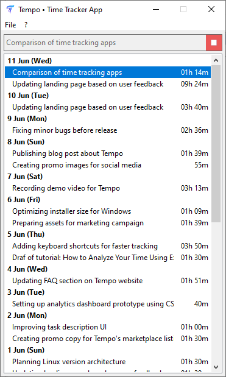

# Tempo • Time Tracker App

A simple, native time tracking application for personal productivity and offline use.

Tempo is a lightweight desktop app designed to track working time with minimal system resources.

It stores all data in plain CSV files and works without internet or browser dependencies.

The project is fully open source under the MIT license.


---

## 📸 Screenshots

<div align="left">
  <a href="./docs/screenshots/1.png"></a>
  <a href="./docs/screenshots/2.png"></a>
  <a href="./docs/screenshots/3.png"></a>
</div>

---

## 📋 Features

- **Offline-first**: Runs entirely offline, no internet connection required.
- **Native desktop app**: No Electron, no web wrappers — built with Lazarus/FPC for performance and low resource usage.
- **CSV-based storage**: All tracked time is stored in open, human-readable CSV files.
- **Task descriptions**: Add context to each session with task names and descriptions.
- **System tray support**: Minimize to tray and continue tracking in the background.
- **Open source**: Full source code available under the MIT License. You can inspect, modify, build, and redistribute it freely.
- **Cross-platform roadmap**: Currently supports Windows. Linux and macOS versions are planned.

---

## 🔍 Why Open Source?

Being open source means:
- **Transparency**: You can verify what the app does and how your data is handled.
- **Customization**: Modify the app to suit your own workflow or integrate it into your toolchain.
- **Community-driven development**: Anyone can contribute bug fixes, features, or improvements.
- **No vendor lock-in**: Even if the project stops active development, you still have access to the full codebase.

---

## 🧩 Technologies

- Language: Object Pascal (Free Pascal Compiler)
- Framework: LCL (Lazarus Component Library)
- Data format: Plain text CSV
- UI: Minimalist native interface
- Build system: Lazarus IDE

---

## 🗂️ File Structure

```
/ tempo
  ├── docs/          # Documentation and website
  ├── src/           # Source code
```

---

## 🔧 Building from Source

1. Install [Lazarus](https://www.lazarus-ide.org/)
2. Clone the repository:
   ```bash
   git clone https://github.com/elcoan/tempo.git
   ```
3. Open `tempo.lpr` in Lazarus
4. Compile and run

---

## 📄 Data Format

Time tracking logs are saved as plain CSV files. Example:

```csv
Date,Start,End,Task,Duration
2025-05-01,09:30,11:15,"Designing Tempo app interface",105
2025-05-01,13:00,14:30,"Setting up local data storage",90
```

Each file can be opened in Excel, Google Sheets, or parsed via Python, R, etc.

---

## 🚥 Planned Features

- Editable log viewer
- Import/export options
- Weekly summary reports
- Linux and macOS support

---

## 🤝 Contributing

Contributions are welcome! If you want to help with:
- Porting to Linux/macOS
- Improving the UI
- Fixing bugs or adding features

---

## 📬 Feedback and Support

If you have questions, feedback, or need help with Tempo, feel free to reach out using any of the following channels:

- 🌐 **Project Site**: [https://elcoan.github.io/tempo/](https://elcoan.github.io/tempo/)
- 📧 **Email**: [hello.tempo.app@gmail.com](mailto:hello.tempo.app@gmail.com)
- 💬 **Telegram Group**: [@tempo_chat](https://t.me/tempo_chat)

We're happy to hear from you!

---

## 📄 License

MIT License — see the [LICENSE](LICENSE.md) file for details.

You are free to use, modify, and distribute the software in both commercial and personal projects.
